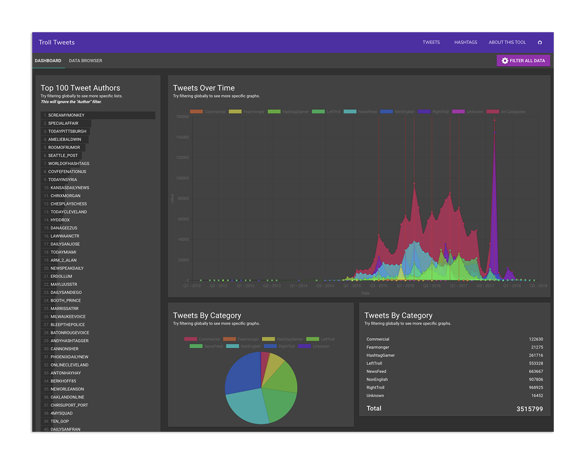

# [TrollTweets.com](http://trolltweets.com/)
Vue 2 app for navigating and auditing the tweets that were released by [FiveThirtyEight](https://fivethirtyeight.com/features/why-were-sharing-3-million-russian-troll-tweets/) on [GitHub](https://github.com/fivethirtyeight/russian-troll-tweets/). Uses a backend API built with Laravel 5.6.



## Table of Contents

* [Installation](#installation)
* [Artisan Commands](#artisan-commands)
* [Changelog](#changelog)
* [Planned Enhancements](#planned-enhancements)
* [Known Issues](#known-issues)
* [Contributions](#contributions)
* [Credits](#credits)
    
# Installation
#### 1) Checkout Repo
```bash
git clone git@github.com:mbitson/trolltweets.git troll-tweets
```
#### 2) Pull Submodules
```bash
git submodule init
git submodule update
# Note that this includes this submodule: https://github.com/fivethirtyeight/russian-troll-tweets/
```
#### 3) Install composer dependencies
```bash
composer install
```
#### 4) Configure Laravel
```bash
cp .env.example .env
# Configure .env with database settings (may require you create a DB)
```
#### 5) Generate Laravel Key
```bash
php artisan key:generate
```
#### 6) Migrate Database
```bash
php artisan migrate
```
#### 7) Seed Tweets
```bash
php artisan db:seed  # This process may take awhile. (~3 million records)
# Will pull tweet data from database/seeds/russian-troll-tweets (a submodule of this repo)
```
#### 8) Extract Elements from Tweets
```bash
php artisan trolls:hashtags  # This process may take awhile. (~3 million records)
php artisan trolls:links  # This process may take awhile. (~3 million records)
```
#### 9) Generate Assets
```bash
npm install
npm run dev #or `npm run watch` to watch files for changes
```
#### 10) Serve The Site
```bash
php artisan serve
```
That is it! You should now be able to access the site at [http://localhost:8000/](http://localhost:8000/).

## Artisan Commands
### trolls:hashtags
Generates hashtag models based on current tweets in database. It's recommended you seed before extracting hashtags.

| Option | Description | Default |
| --- | --- | --- |
| --batches | The number of tweet batches to process. 0 will process all tweets. | 0 |
| --batch-size | The number of tweets should each batch process. | 10 |

### trolls:links
Generates link models based on current tweets in database. It's recommended you seed before extracting links.

| Option | Description | Default |
| --- | --- | --- |
| --batches | The number of tweet batches to process. 0 will process all tweets. | 0 |
| --batch-size | The number of tweets should each batch process. | 10 |

## Changelog
- 8/7/2018 - Initial launch of the site at [trolltweets.com](http://trolltweets.com/)

## Planned Enhancements
- Add a filter bar showing current filters without opening the bottom sheet.
- Add a table-style "Data Browser" using the same global filters.
- Allow the user to obtain a permalink that applies all current filters.

## Known Issues
- In some cases it appears that the tweet totals are incorrect.

## Contributions
Contributions to this repository are welcome. Simply submit a PR to the `develop` branch and wait for approval. If you have any questions or concerns about the codebase please open an issue.

## Credits
- [Mikel Bitson](http://mbitson.com/)